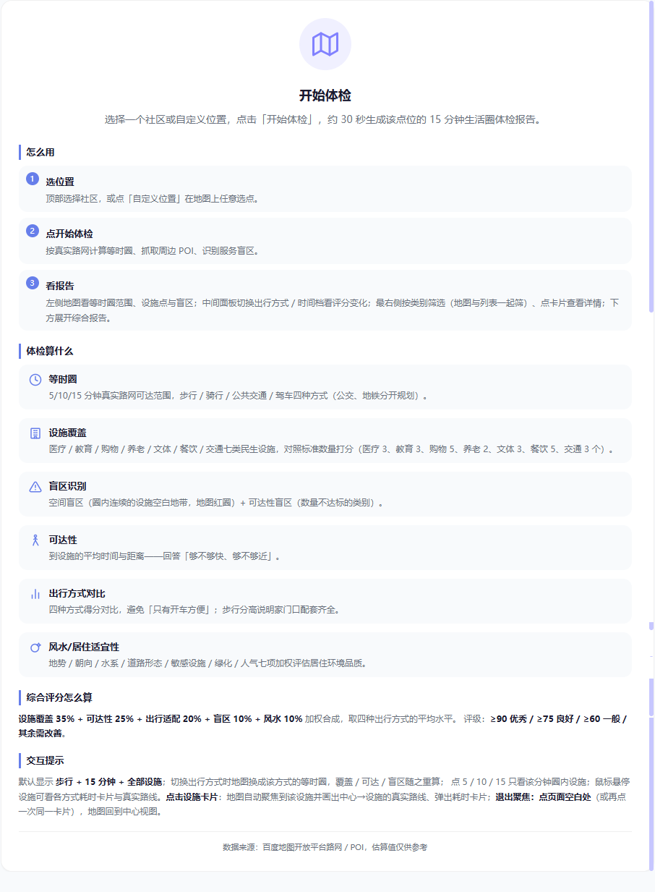
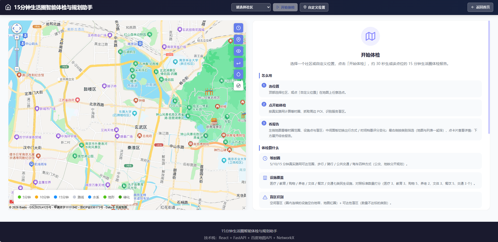
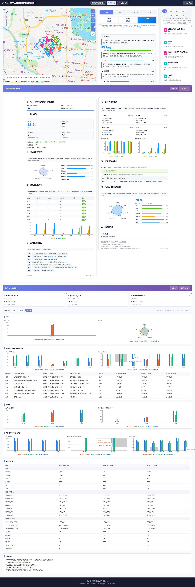
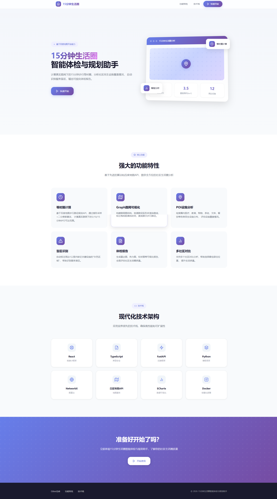

# 15分钟生活圈智能体检与规划助手

[](LICENSE)
[](https://github.com/mengjianan/15min-life-circle/actions/workflows/ci.yml)

基于**百度地图开放能力**，计算真实路网下的 15 分钟生活圈等时圈，分析社区七类民生设施覆盖，自动识别服务盲区，输出可视化体检报告，并支持多社区多维对比。面向街道社区体检、公共设施规划选址、居民选房参考等场景。

**在线体验**：[介绍首页](https://mengjianan.github.io/15min-life-circle/) · [应用（/app/）](https://mengjianan.github.io/15min-life-circle/app/)



## 界面导览

| 界面 | 说明 |
|---|---|
| **应用初始**：地图 + 使用手册 | 左侧地图（可点击选点、图层控制），右侧「怎么用 / 体检算什么 / 评分怎么算」说明手册 |
| **体检主界面**：三栏联动 | 地图（等时圈 + 设施点 + 盲区）｜评分面板（4 出行方式 × 5/10/15 分钟切换）｜设施列表（7 类筛选） |
| **综合报告** | 报告下拉条展开：核心结论、五维雷达、设施覆盖统计、出行方式对比、盲区识别、风水/居住适宜性、规划建议 |
| **社区对比** | 「最近三次体检对比」下拉条：总览、设施、时间、方式/盲区/风水六维图表 + 全维度总表 + 自动结论 |







## 功能特性

- **真实路网等时圈**：扇形采样（36 方向）+ 二分搜索调用批量路线矩阵实测耗时，生成 5/10/15 分钟可达范围；步行 / 骑行 / 公共交通（公交、地铁分开规划）/ 驾车四种方式
- **POI 设施覆盖**：医疗、教育、购物、养老、文体、餐饮、交通**七类民生设施**检索、去重、距离过滤，对照标准数量打分
- **盲区识别（双口径）**：空间盲区（圈内连续设施空白地带，地图红圈标注）+ 可达性盲区（各类别可达数量与标准的缺口）
- **可达性与出行对比**：到设施的平均时间/距离、四方式得分对比——回答「够不够快、够不够近、哪种方式最方便」
- **综合体检报告**：核心结论、综合评分五维、设施覆盖分档统计、最近设施速度、服务盲区识别、规划建议，下拉展开
- **社区多维对比**：自动记录最近三次体检（本地 IndexedDB），按综合 / 设施 / 时间 / 出行方式 / 盲区 / 风水六维横向对比，含全维度总表与自动结论
- **地图交互**：悬浮设施弹各方式耗时卡片、点击聚焦并绘制中心→设施真实路线、5/10/15 分钟档切换、图层控制
- **风水 / 居住适宜性**：地势、朝向、水系、道路形态、敏感设施、绿化、人气七项加权评估
- **报告导出 PDF**：两条下拉条内一键导出，PDF 与页面显示完全一致
- **容错与演示**：预设四街道内置快照（API 失败自动降级展示）、内置演示数据、设施路线 30 天本地缓存

## 使用流程

1. 顶部选择社区（或点「自定义位置」/地图选点，需输入防滥用密码）
2. 点「**开始体检**」，约 30 秒生成该点位的 15 分钟生活圈体检报告
3. 地图查看等时圈 / 设施 / 盲区，中间面板切换出行方式与时间档，右侧筛选设施
4. 展开「15分钟生活圈体检报告」查看完整报告
5. 展开「最近三次体检对比」横向对比多个社区，或一键导出 PDF

## 快速部署

### 前置条件

- Docker 20.0+
- Docker Compose 2.0+
- 百度地图 API AK

### 一键部署

1. 克隆仓库
2. 配置环境变量：`cp .env.example .env`
3. 编辑 `.env` 文件，填入百度地图 AK
4. 启动服务：`docker-compose up -d`
5. 访问前端：http://localhost:3001（端口 3001，体检等接口经 nginx 同源代理到后端）

## 技术架构

```
浏览器  React 18 + TypeScript + Vite + 百度地图 JS SDK + Recharts
                    │  同源 /api（nginx 反向代理）
                    ▼
FastAPI（Python）── SQLite 结果缓存 · QPS 限流 · 真实/模拟分级降级
   ├─ 等时圈引擎：routematrix/v2 批量测时（36 向 × 二分搜索）→ 三次样条插值平滑
   ├─ POI 分析：place/v2 检索 → 去重 / 分类标准化 / 距离过滤 → 七类覆盖评分
   ├─ 盲区识别：空间网格覆盖计算 + 可达性缺口（按类别，数量 vs 标准）
   └─ 路网 Graph：NetworkX 构图，按道路实际形状渲染路线
```

### 百度地图 API / SDK 使用清单

| 服务 | 端点 | 用途 |
|---|---|---|
| Web 地理编码服务 | `geocoder/v2` | 坐标↔地址互查、自定义选点按道路命名社区 |
| Web 地点检索服务 | `place/v2/search` `place/v2/detail` | 七类民生设施 POI 检索与详情 |
| Web 路线规划服务 | `directionlite/v1`（walking/riding/driving/transit） | 真实路线与耗时，等时圈与悬浮路线 |
| Web 批量路线矩阵 | `routematrix/v2`（单次 ≤64 终点） | 等时圈多方向批量测时（核心性能优化） |
| 地图 JS SDK | 地图 / 覆盖物 / 事件 | 地图展示、等时圈多边形、设施与盲区标注、点击选点 |
| JS 检索与路线 | `LocalSearch` / 四类路线 / `Geocoder` / `getDistance` | 客户端设施检索、悬浮真实路线、逆地理解析、距离计算 |

### 目录结构

```
frontend/          React + TS + Vite 前端（src/components、services、config.ts）
backend/           FastAPI 后端
  ├─ api/          接口（full-analysis、isochrone、poi、graph…）
  ├─ core/         等时圈引擎、POI 分析、盲区识别、评分、风水、路网
  └─ services/     百度地图客户端、SQLite 缓存、限流器
app/               前端构建产物（GitHub Pages /app/ 发布目录）
docs/              技术设计文档、界面截图
.github/workflows/ CI（后端 lint+测试、前端构建、Docker 构建）、Pages 自动发布
docker-compose.yml + Dockerfile.* + nginx.conf   一键部署
```

## 防滥用与容错（评审说明）

### 自定义选点密码
- 「自定义位置」与地图上的「点击地图选择位置」需输入密码（防滥用闸门）
- **密码在哪**：见随附提交材料——《作品介绍文档》或提交邮件（仓库内不直接公开）；输入正确后本次浏览器会话不再询问
- 四个预设社区不受限制
- 目的：开源部署后防止任意坐标反复调用地图 API（地理编码 / POI 检索 / 路径规划）刷爆配额
- 部署方如需更换，自行设置 `frontend/src/config.ts` 的 `CUSTOM_POINT_PASSWORD` 后重新构建

### 预设社区缓存快照
- 四个预设街道（湖南路 / 中央门 / 新街口 / 夫子庙）的完整体检结果内置在 `frontend/public/snapshots/`
- 等时圈、POI 检索等任一地图 API 调用失败时，前端自动降级展示对应快照，页面内容正常显示（顶部横幅提示已展示缓存数据，可重试）
- 快照为真实体检结果快照，随构建产物一同分发，断网 / 限流 / 后端不可达时演示不空白

## 开发与测试

```bash
# 前端
cd frontend && npm ci
npx tsc --noEmit        # 类型检查
npm run build           # 构建

# 后端
cd backend && pip install -r requirements.txt
pytest                  # 单元测试
flake8 .                # 代码风格
```

CI（GitHub Actions）在每次推送时自动运行：后端 flake8 + pytest、前端类型检查 + 构建、Docker 镜像构建、GitHub Pages 发布。

## 文档

- [技术设计文档](docs/technical-design.md) —— 地图 API 调用策略、等时圈生成算法（扇形采样 + 二分搜索 + 样条插值）、POI 数据清洗策略、盲区识别算法、风水检测算法

## License

MIT License
